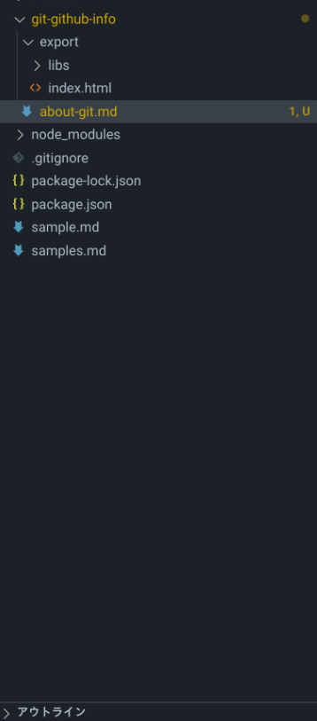

---
transition: "convex"
slideNumber: true
title: "gitとgithubについて"
---


## GitとGitHubについて

---

## 目的

* Gitを覚えることで様々な分野で応用が効く{.fragment  .fade-left}
* GitHubを覚えることで成果物を表現しやすくなる{.fragment  .fade-left}

---

## (年間を通しての)目標

* 自分のGitHubリポジトリを作成する{.fragment  .fade-left}
* GitHubからcloneしてpush迄行えること{.fragment  .fade-left}
* Gitのメリットを理解する{.fragment  .fade-left}
* GitHubの操作に慣れる{.fragment  .fade-left}

---

## 目標の内容について

* 計画外実績に書く。{.fragment  .fade-left}
* スキルシートにも書いても良い{.fragment  .fade-left}
  * 個人開発系でGitHubのURLが書いてあるのも有。{.fragment  .fade-left}

---

## Gitとは

* バージョン管理システム {.fragment  .fade-left}
  * その他、SubVersionというシステムが有名{.fragment  .fade-left}
* リーナス・トーバルズという人物が開発 {.fragment .fade-left}
  * Linux開発で有名。 {.fragment .fade-left}

* シェア１位。（2位がSubVerison) {.fragment .fade-left}

* GitHub,GitLabなどのホスティングサイトが人気 {.fragment .fade-left}

---

## バージョン管理システムとは？

* ファイルの履歴管理が可能(git log) {.fragment  .fade-left}
* いつ、誰が直したのか調べることが可能(git blame) {.fragment  .fade-left}
* 複数の人が同時に同じファイルを修正することも可能
  (git branch,git merge) {.fragment  .fade-left}
  * １人で開発していて現在の資材と分けて開発することも可能。 {.fragment  .fade-left}
    * 例えば、PCアプリを開発していてスマホ向けにも開発を行う等
      現行機能を残しつつ先行開発を実施する場合。{.fragment  .fade-left}

---

## 用語について

* gitで使われる用語についてざっくり紹介 {.fragment  .fade-left}
* いろいろあるけどとりあえず必要な部分だけ{.fragment .fade-left}

--

## 用語解説注意点

* かなり特殊な用語が多いが。。。{.fragment .fade-left}
* 割と環境毎に完結したコマンドばかり。{.fragment .fade-left}
* 覚えられれば、忘れにくい（と思う。）{.fragment .fade-left}
* ただし、Suberverisonユーザからすると相当難しく感じることも{.fragment .fade-left}

--

## リポジトリ

* １つ以上のプロジェクトをまとめる単位{.fragment  .fade-left}
* 英語の意味の通り、「貯蔵庫」、「収納庫」と考えると良い{.fragment  .fade-left}
* １つのリポジトリには複数のブランチが存在し、1対Nの関係性がある{.fragment  .fade-left}

--

## ブランチ

* 複数人が並行した作業を行うための環境単位{.fragment .fade-left}
* プロジェクト内での環境を分ける単位{.fragment .fade-left}
  * 商用、開発用、不具合改修用/先行開発用等、多岐に渡る{.fragment .fade-left}
* すべての資材はブランチによって管理される{.fragment .fade-left}
* gitには２種類のブランチがある{.fragment .fade-left}

--

## ローカルブランチ

* 分散型管理と呼ばれる理由の一つ{.fragment .fade-left}
* ローカル（自分のPC)内でコミット(保存)を行うことができる{.fragment .fade-left}
* ローカルでの操作はcommit、checkoutがある{.fragment .fade-left}
  * commitは保存{.fragment .fade-left}
  * checkoutはブランチの切替又は作成を行える{.fragment .fade-left}
* 作成したブランチはまとめる(marge/rebase)こともできる{.fragment .fade-left}

--

## リモートブランチ

* リモート上にあるブランチ(github)を指す{.fragment .fade-left}
* ローカルブランチをupload(push)したり、  
  download(pull)したりすることができる{.fragment .fade-left}
* いくつかコマンドがあるが、push,pull,fetch,cloneが主に使用されるコマンドとなる{.fragment .fade-left}

--

## リモートブランチ2

* fetchはremote→localブランチへの反映{.fragment .fade-left}
* margeはlocalブランチから作業ツリーへの反映を行う{.fragment .fade-left}
* pullは、fetchとmarge両方を行うコマンド。{.fragment .fade-left}
* cloneは初回でremoteリポジトリをcheckoutする{.fragment .fade-left}

--

## 作業ツリー

* ローカル上のgitプロジェクトフォルダを指す。{.fragment .fade-left}
* checkoutされているブランチの資材を操作できる場所{.fragment .fade-left}

--

## ステージング

* コミットするファイルの退避場所{.fragment .fade-left}
* gitのコミットの流れ{.fragment .fade-left}
  1. ファイルを変更する{.fragment .fade-left}
  2. git addによって作業ツリー→ステージングに移す{.fragment .fade-left}
  3. git commitによってステージング→ローカルブランチに移す{.fragment .fade-left}

---

## 操作イメージについて

* 雰囲気を掴んでもらうために、  
  どういった操作方法等かについて紹介{.fragment  .fade-left}
* ここで覚えるというよりも何ができるのかという点が重要{.fragment  .fade-left}

---

## git log

```bash
FutureHouseholdAccountBook $ git log
commit 7e967761b009e00d0fc39b9a01b37c2a25ea34bd (HEAD -> main)
Merge: cf79578 522be8c
Author: homuhomu <dummy20211024@gmail.com>
Date:   Sun Oct 17 18:23:47 2021 +0900

    マージ

commit cf795788a0f9d93ae1da89380fb622fb1bb5aa0a
Author: homuhomu <dummy20211024@gmail.com>
Date:   Sun Oct 17 18:22:43 2021 +0900

    フォルダ変更

commit 522be8cf1a00799c1f3b33a27ec50074f63aa6d6 (origin/main, origin/HEAD)
Author: homuhomu <dummy20211024@gmail.com>
Date:   Sun Oct 17 18:06:42 2021 +0900

    jest 対応
```

---

## git logざっくり要点解説

* commit・・・コミット毎に一意の番号が採番される。{.fragment  .fade-left}
* Merge・・・特殊。(他の変更履歴を取り込むと表示される){.fragment  .fade-left}
* Author・・・コミットした人{.fragment  .fade-left}
* Date:・・・・コミットした日。{.fragment  .fade-left}
* コメント・・変更点等を記載{.fragment  .fade-left}

---

## git show

```bash
cols-check-pages $ git show
commit 97b1ea89aed68fdc50ce65fd1a1eda12fe9c7eb9 (HEAD -> main, origin/main, origin/HEAD)
Author: homuhomu <dummy20211024@gmail.com>
Date:   Sat Sep 25 01:53:59 2021 +0900

    row height size full setting

diff --git a/components/colsInput.vue b/components/colsInput.vue
index 2a6264a..6e6d0a0 100644
--- a/components/colsInput.vue
+++ b/components/colsInput.vue
@@ -7,7 +7,6 @@
     :sm="data.sm"
     :xs="data.xs"
     style="border: dotted 1px"
-    name="div"
   >
     <v-row>
       <v-col cols="12">
```

---

## git show要点

* 最新のコミット時の変更点についての差分表示{.fragment  .fade-left}
* +が追加で-が削除(行単位)となる{.fragment  .fade-left}
* 例のケースでいうと、行の削除だけ行われている{.fragment  .fade-left}

---

## git blame

```git
FutureHouseholdAccountBook $ git blame -L 200,210 pages/inputNumbers.vue
6eb8d663 (HomuHomu 2021-08-15 15:48:32 +0900 200)       }
6eb8d663 (HomuHomu 2021-08-15 15:48:32 +0900 201)     })
^56e41bb (HomuHomu 2021-08-14 19:33:48 +0900 202)     return {
5eac4e3b (HomuHomu 2021-08-29 09:00:20 +0900 203)       currentDate: dayjs(new Date()),
^56e41bb (HomuHomu 2021-08-14 19:33:48 +0900 204)       tab: null,
48a4a1f7 (HomuHomu 2021-08-19 02:06:16 +0900 205)       tabMenus,
6eb8d663 (HomuHomu 2021-08-15 15:48:32 +0900 206)       timeMoneys,
dd7a102d (homuhomu 2021-09-05 04:35:28 +0900 207)       TabStatus,
7cafabc0 (homuhomu 2021-10-02 12:07:38 +0900 208)       menuView: true,
0449d78c (homuhomu 2021-10-03 13:05:08 +0900 209)       allKey: false
^56e41bb (HomuHomu 2021-08-14 19:33:48 +0900 210)     }
FutureHouseholdAccountBook $ 
```

---

## git blame要点

* 単一のファイルの変更点を調べるコマンド{.fragment  .fade-left}
* 例のケースのコマンド-L 200,210で行数の指定{.fragment  .fade-left}
* 後ろのpages/inputNumbers.vueはファイル名{.fragment  .fade-left}
* よって、200〜210行目の変更履歴が表示されている{.fragment  .fade-left}
* 6eb8d663は、コミットハッシュと呼ばれるコミットIDの短縮形。{.fragment  .fade-left}
  * 厳密にはいろいろ呼び方がありそうななさそうな。{.fragment  .fade-left}

---

## git branch

```bash
FutureHouseholdAccountBook $ git branch
* main
FutureHouseholdAccountBook $ git branch develop
FutureHouseholdAccountBook $ git branch
  develop
* main
FutureHouseholdAccountBook $ git checkout develop
M       .nuxt/routes.json
M       package-lock.json
M       package.json
Switched to branch 'develop'
FutureHouseholdAccountBook $ git branch
* develop
  main
FutureHouseholdAccountBook $ 
```

---

## git branch要点前解説

* ブランチはgitで重要な機能の一つ。{.fragment  .fade-left}

* ここで覚えられなくても仕方ない{.fragment  .fade-left}
  * というかこれで覚えられるのは知っているか天才だけ。{.fragment  .fade-left}

---

## git branch要点

* 様々な環境を用意するための機能{.fragment  .fade-left}
  * 商用環境(現在サービスが可動中の機能){.fragment  .fade-left}
  * 開発環境(先行開発資材がコミットされている環境){.fragment  .fade-left}
  * 先行開発環境(１人の人が開発している環境){.fragment  .fade-left}

---

## git branch要点その2

* 現在のチェックアウトされているブランチ名を取得{.fragment  .fade-left}
  * git bracnh{.fragment  .fade-left}
* 現在のブランチから新しいブランチ(develop)を生成{.fragment  .fade-left}
  * git branch develop{.fragment  .fade-left}

---

## git branch要点その3

* ブランチを切り替える場合はgit checkout "blanch name" {.fragment  .fade-left}
  * git checkout develop{.fragment  .fade-left}
* 枝分かれしたブランチを反映させるときはgit merge "blanch name" {.fragment  .fade-left}
  * developからmainへ資材反映する{.fragment  .fade-left}
  * git checkout main{.fragment  .fade-left}
  * git merge develop{.fragment  .fade-left}

---

## git branch要点その4

* git branch周りは覚えるのは難しい。{.fragment  .fade-left}
* 一般的には以下の通り{.fragment  .fade-left}
  * 商用環境・・・・main/masterブランチ{.fragment  .fade-left}
  * 開発環境・・・・developブランチ{.fragment  .fade-left}
  * 先行開発分・・・feature/fixMailSendBug(フィーチャーブランチ）{.fragment  .fade-left}
* ・・・といった区分けがあり、名前によって用途を分ける運用。{.fragment  .fade-left}

---

## git branch要点その5

* 一人の場合は適当でも良い(Privateリポジトリとか）{.fragment  .fade-left}
* しかし命名規則ぐらいは一般に合わせるほうが無難{.fragment  .fade-left}
  * Gitが使える基準がチーム開発可能かどうかという点も考慮{.fragment  .fade-left}

---

## GitHub、GitLabについて

* コードをホスティングするサービス{.fragment  .fade-left}
  * ホスティングとは、「サーバーを借りる」という意味{.fragment  .fade-left}
  * 要するにコード管理するサーバを借りているサービス{.fragment  .fade-left}
* GitLabは別会社なだけなのでとりあえずGitHubだけ紹介{.fragment  .fade-left}

---

## コードホスティングサービス(GitHub)のメリット

* 情報共有のしやすさ{.fragment  .fade-left}
  * インターネットがあればどこでも開発が可能。{.fragment  .fade-left}
* 無料で使えて連携サービスが豊富{.fragment  .fade-left}
  * むしろ使えないほうがまずい状況になってきている。。。{.fragment  .\fade-left}

--

## ポートフォリオの配置場所として最適

* 静的ファイルならGitHub Pages{.fragment  .fade-left}
  * GitHub Actionsを使えばbuildしてgh-pagesブランチにbuildしてくれる{.fragment  .fade-left}
* 動的ファイルならHeroku等のPassに連携することも可能。{.fragment  .fade-left}
  * Java、Ruby、python、Node.js等{.fragment .fade-left}
* 最近だと、デザイナーでも利用されている{.fragment  .fade-left}
  * 1ファイル100MBファイル制限があるため、Git LFSが必須。{.fragment  .fade-left}

--

## 要するに

* GitHubがあるだけで成果物を用意する箱ができてしまう。{.fragment  .fade-left}
* ある程度のGitの操作ができるだけでも今後に役立つ{.fragment  .fade-left}

--

## 唯一のデメリット

### 習得が難しい{.fragment .fade-left}

### Subversionを知っている人は特にむずい{.fragment .fade-left}

---

## GitHubのメリットその2

* ポートフォリオを作りやすい{.fragment  .fade-left}

* GitHubならGitHub Pagesを使うと静的コンテンツならWEBページを作成できる{.fragment  .fade-left}
  * <https://homuhomu20210905.github.io/cols-check-pages/>  {.fragment>  .fade-left}
* 動的コンテンツ(Javaなど)でもHerokuと連携することができる{.fragment  .fade-left}
  * 今回はHerokuについては解説はしないが、いわゆるPaas。

---



---
