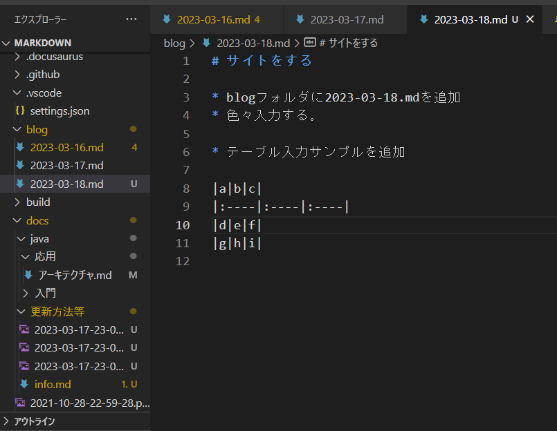
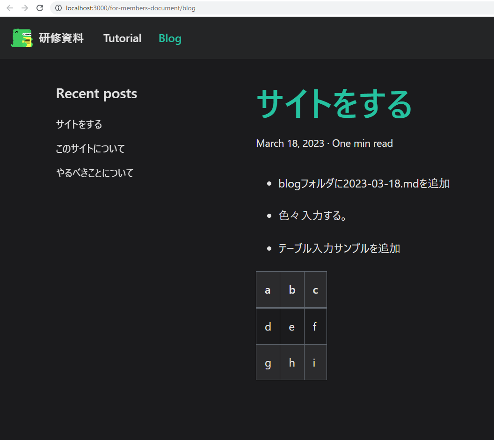
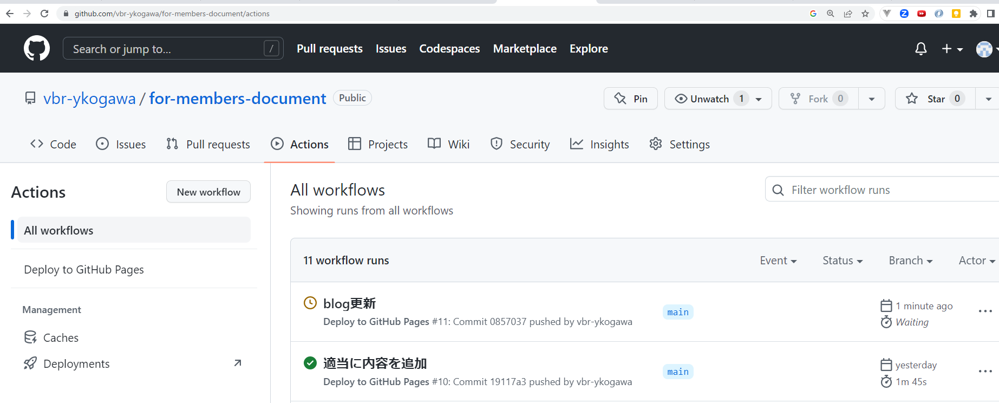
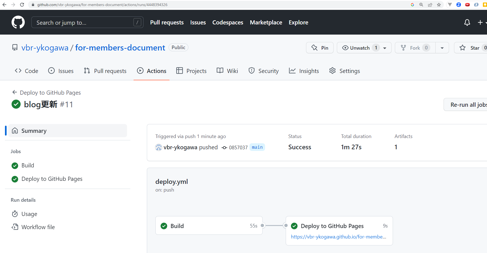
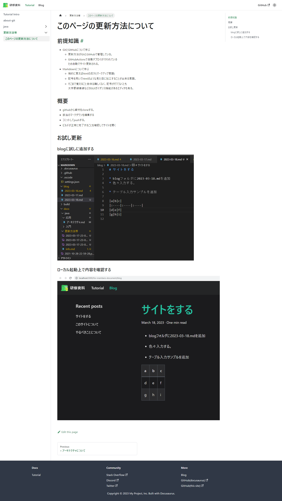
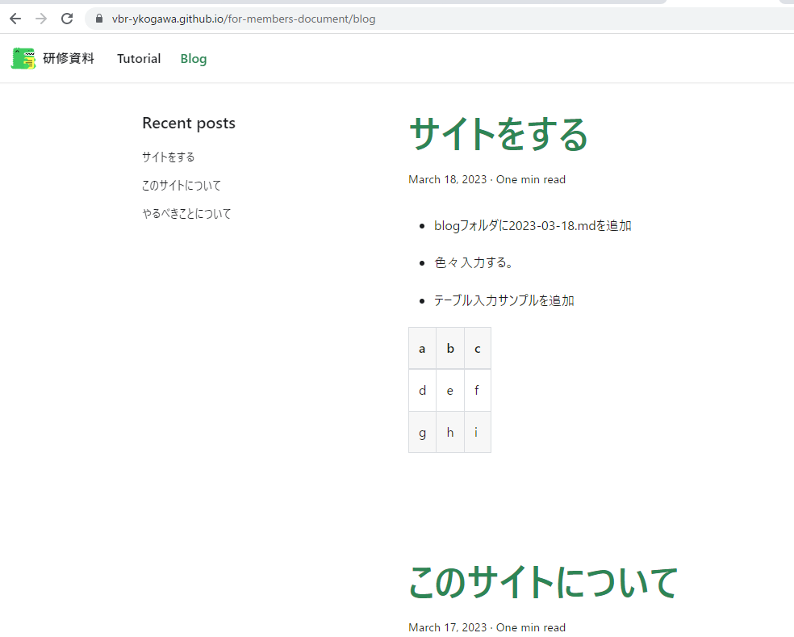

# このページの更新方法について

## 前提知識

### GitとGitHubについて学ぶ

* 更新方法がGitとGitHubで管理している。
* GitHubActionsで自動デプロイが行われている  
  ため自動でサイト更新される。

### Markdownについて学ぶ

* 端的に言えばhtmlの反対(マークアップ言語)
* 記号を用いてhtmlのような見た目に加工することが出来る言語。
* そこまで覚えること自体は難しくなく、記号が打てなくとも  
    太字罫線車線などのGUIガイダンス機能があるエディタも有る。

### docusaurusについて学ぶ

* マークダウンをhtml形式のファイルにトランスコンパイルしてくれるライブラリ
* Facebook(現meta社)作成
* ReactベースのライブラリでReactも書ける。

## 概要

* githubから資材をcloneする。
* 該当のマークダウンを編集する
* コミットしてpushする。
* ビルドが正常に完了することを確認してサイトを開く

## 更新操作のイメージについて

### blog内に[2023-03-18.md]を追加する



### ローカル起動上で追加した内容を確認する



### Gitでcommitを行う

```bash
PS D:\SSD\projects\document\markdown> git add .
PS D:\SSD\projects\document\markdown> git commit -m 'blog更新'
[main 0857037] blog更新
 19 files changed, 50 insertions(+), 503 deletions(-)
 create mode 100644 blog/2023-03-18.md
 delete mode 100644 docs/tutorial-basics/_category_.json
 delete mode 100644 docs/tutorial-basics/congratulations.md
 delete mode 100644 docs/tutorial-basics/create-a-blog-post.md
 delete mode 100644 docs/tutorial-basics/create-a-document.md
 delete mode 100644 docs/tutorial-basics/create-a-page.md
 delete mode 100644 docs/tutorial-basics/deploy-your-site.md
 delete mode 100644 docs/tutorial-basics/markdown-features.mdx
 delete mode 100644 docs/tutorial-extras/_category_.json
 delete mode 100644 docs/tutorial-extras/img/docsVersionDropdown.png
 delete mode 100644 docs/tutorial-extras/img/localeDropdown.png
 delete mode 100644 docs/tutorial-extras/manage-docs-versions.md
 delete mode 100644 docs/tutorial-extras/translate-your-site.md
 create mode 100644 "docs/\346\233\264\346\226\260\346\226\271\346\263\225\347\255\211/2023-03-17-23-11-38.png"

 create mode 100644 "docs/\346\233\264\346\226\260\346\226\271\346\263\225\347\255\211/2023-03-17-23-12-19.png"

 create mode 100644 "docs/\346\233\264\346\226\260\346\226\271\346\263\225\347\255\211/info.md"
```

### 続けてpushを実施する。(GitHubActionsが自動で動く)

```bash
PS D:\SSD\projects\document\markdown> git push origin
Enumerating objects: 26, done.
Counting objects: 100% (26/26), done.
Delta compression using up to 12 threads
Compressing objects: 100% (16/16), done.
Writing objects: 100% (16/16), 98.34 KiB | 24.58 MiB/s, done.
Total 16 (delta 6), reused 0 (delta 0), pack-reused 0        
remote: Resolving deltas: 100% (6/6), completed with 6 local objects.
To https://github.com/vbr-ykogawa/for-members-document.git
   19117a3..0857037  main -> main
PS D:\SSD\projects\document\markdown> 
```

### GitHubActions起動



### 正常にbuildされた状態



### 内容を確認

* 更新内容


* blogの内容

